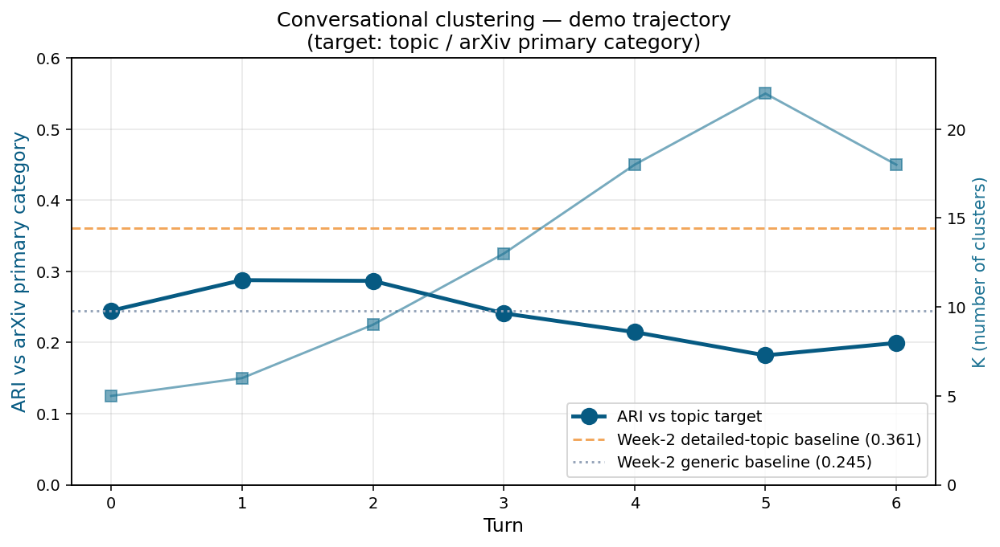

# Conversational Clustering: Measuring Bias-Override in Multi-Turn LLM-Guided Clustering

**Author:** Romain NOBLET
**Course:** Knowledge Discovery and Pattern Extraction,  Università degli Studi di Trento
**Date:** 05/06/2026

---

## Abstract

Clustering is ill-posed without specifying user intent: the same data admits multiple valid clusterings, and recent LLM-guided systems make natural-language intent expression possible. We measure how much the structure of LLM-clustering interaction (one-shot vs multi-turn) matters as a function of how much the user's intent conflicts with the embedding's default similarity. On 200 arXiv astro-ph abstracts with Claude Sonnet 4.6, one-shot detailed prompting reaches ARI = 0.36 against arXiv categories on a topic axis (aligned with embedding defaults) but only 0.07 on a methodology axis (orthogonal). The 0.29 ARI spread is the magnitude of the bias-override problem on this corpus. A demo run of a multi-turn conversational system on the easy target shows the loop closes end-to-end, and surfaces a coordination failure between the LLM router and the simulated user that two targeted prompt-level interventions resolve. We do not run the full 3-target × 3-system × N-replication experiment for this submission; the contribution at this stage is quantification of the gap, validation of the infrastructure, and identification of a semantic-split limitation as the next architectural bottleneck.

---

## 1. Introduction

Clustering is one of the oldest problems in unsupervised learning, and one of the most ill-posed. Given a set of items, the right partitioning depends on what the user is trying to learn — and that intent is rarely visible to the algorithm. The same 200 astronomy abstracts can plausibly be grouped by subject area, by methodology, by writing register, by the physical scale of the objects being studied. There is no single "correct" answer; there are several, each useful for different downstream tasks.

Recent work has begun to address this by putting large language models in the clustering loop. ClusterLLM, ITGC, InBedder, and others give the user a way to express intent in natural language, and translate that intent into operations on a classical pipeline. These systems work well on standard benchmarks. But standard benchmarks have a hidden property: their ground-truth labels tend to align with what sentence embeddings naturally cluster on. The hard case — when a user wants a clustering that *conflicts* with the embedding's default similarity — is under-studied.

This work measures how much that conflict matters, on a single corpus of 200 arXiv astro-ph abstracts. We compare one-shot LLM clustering (with and without axis guidance) against a multi-turn conversational system that maps user feedback to typed operations on the pipeline. Three target axes of varying conflict-with-defaults are used: topic (aligned), object scale (partially aligned), methodology (orthogonal). The contribution is empirical, not architectural: we report the magnitude of the bias-override effect and characterise the design space of an LLM-LLM conversational loop.

The rest of the paper is organised as follows. §2 surveys the three threads of literature the project sits between. §3 details the study design — operationalisation of "user intent", construct validity, statistical plan. §4 describes the system architecture and the operation vocabulary. §5 reports results: one-shot baselines, a demo run of the conversational loop, and qualitative analysis. §6 discusses what was hard, §7 limitations, §8 ethics, and §9 concludes.

---

## 2. Related Work

[See `docs/related_work.md` for the source.]

Recent work has integrated LLMs into clustering pipelines at multiple stages. ClusterLLM (Zhang et al., EMNLP 2023) uses a user-specified "perspective" alongside LLM-judged triplet supervision to refine embedding-based cluster boundaries, and is the closest architectural antecedent to this work; it differs in using structured triplet feedback rather than free-form natural language. ITGC (Iterative Text-Guided Clustering, 2025) iteratively refines clusters via natural-language instructions, but operates on images and treats iteration as system-internal refinement toward a single upfront prompt rather than reactive multi-turn user feedback. InBedder (Peng et al., 2024) modifies the embedding step itself based on user instructions, producing instruction-conditioned representations; this is analogous to the `re-embed` operation listed as a stretch goal of our system. Dial-In LLM (Liu et al., 2024) places an LLM in the loop for dialogue-intent clustering with iterative cluster-level refinement, but is specialized to a particular text genre. Across this thread, evaluations are reported on benchmarks where the labeled ground truth tends to align with what sentence embeddings naturally cluster on — the case our work treats as the "easy" regime.

The system architecture in this work — an LLM router translating natural-language feedback into typed cluster-level operations — is **not novel** relative to ClusterLLM, ITGC, or InBedder. The contribution we claim is empirical, not architectural. Specifically, we measure how the gap between interaction structures (single-shot vs multi-turn) varies with the conflict between the user's target and the embedding's default similarity. Most prior evaluations are reported on a single benchmark per method and report a single ARI; we explicitly vary the *target axis* across three regimes of decreasing alignment with embedding defaults (topic / object scale / methodology) on a fixed corpus, isolating the bias-override effect. To our knowledge this slicing has not been reported cleanly in the LLM-clustering literature.

---

## 3. Study Design

[See `docs/study_design.md` for the long-form source.]

### 3.1 Hidden targets

Three targets of varying conflict with embedding defaults:

- **Topic** (easy, aligned with embedding defaults): arXiv primary category labels.
- **Object scale** (hard): planetary / stellar / galactic / cosmological.
- **Methodology** (hardest, conflicts with embedding defaults): observational / theoretical / simulation / instrumental.

Week 1 inspection of k-means clusters on sentence-transformer embeddings (n=200, K=5) confirmed that all three axes are encoded in the representation, not just topic. One cluster in particular grouped methodology-themed papers (data-analysis pipelines, methods papers, simulation works) across multiple subfields, providing empirical grounding for treating methodology as a non-default axis the embedding still has some signal on.

### 3.2 Three systems

We compare three systems, designed to separate the effect of *information content* from the effect of *interaction structure*:

- **A. One-shot generic.** A single LLM call clusters the corpus into K groups with no axis guidance. Minimal information content.
- **B. One-shot detailed.** A single LLM call receives the full axis description upfront and clusters accordingly. Information content matches the aggregate information delivered across all turns of System C.
- **C. Multi-turn (this work).** A brief initial instruction, then up to six turns of reactive natural-language feedback from the simulated user. The router maps feedback to operations on a classical pipeline.

System B is essential. Without it, any improvement of System C over System A would conflate "feedback helps" with "more information helps." With B as a control, the contribution of *interaction structure* — receiving information reactively turn-by-turn rather than upfront — can be isolated.

### 3.3 Simulated user methodology

The simulated user is an LLM (Claude Sonnet 4.6, temperature 0.4) holding the hidden target description as a goal. It cannot see paper IDs — the user-facing clustering view exposes only labels, sizes, and sample titles — and the system prompt explicitly forbids referencing IDs in feedback. Each turn, the user reads the current clustering view and its own prior messages, then emits 2-4 sentences of conceptual feedback. Anti-cheating compliance is checked programmatically after each turn (a regex catches `paper N`, `[N]`, `abstract N` patterns). The full prompt is in Appendix A.

### 3.4 Metrics and statistical plan

The primary metric is ARI of the system's clustering against the hidden target, recomputed after each turn — producing a trajectory rather than a single value. Secondary metrics include turns-to-threshold (the number of turns required for ARI to cross a fixed value), final ARI at the turn budget, ARI variance across runs (the RQ4 stability question), and a descriptive operation-mix breakdown.

The intended statistical analysis uses bootstrap confidence intervals (1000 iterations, percentile method) on point estimates, with paired bootstrap for pairwise system comparisons within each target. Benjamini-Hochberg correction is applied across the (target × metric) test family at q = 0.05. Confirmatory hypotheses were declared in `docs/study_plan.md` v0.3 before any condition was run. *This statistical analysis is described for completeness but was not executed at the scale of this submission* — see §5.3 and §7.

---

## 4. System Architecture

The system is a classical clustering pipeline (embed → k-means → cluster labels) with an LLM router on top that translates natural-language feedback into typed operations on the pipeline. The architecture is intentionally simple: the contribution we claim is empirical (the bias-override measurement of §5), not the construction of a new clustering algorithm.

### 4.1 Pipeline overview

The pipeline has four components, applied in sequence each turn:

1. **Corpus.** ~200 arXiv astro-ph abstracts, pulled via the official arXiv API and cached locally. The corpus is fixed across the entire experiment.
2. **Embedder.** Each `(title, abstract)` pair is encoded by `all-MiniLM-L6-v2` (sentence-transformers, 384-dimensional, L2-normalized). Embeddings are computed once and reused across all conditions.
3. **Clustering.** Standard k-means on the embedding matrix produces an initial assignment. K is an exposed parameter the router can modify.
4. **Cluster summarizer.** For each cluster, a brief LLM call (Sonnet 4.6, ≤30 tokens) produces a 2-5 word label from sample titles. Labels are what the simulated user sees; they are also what the router uses to identify clusters in subsequent reasoning.

The router and the simulated user are LLM-driven and sit *outside* this static pipeline; they read its current state and emit feedback (user) or operations (router) that modify it.

### 4.2 Operation vocabulary

The router translates natural-language feedback into typed operations on the clustering:

| Operation | Effect |
|-----------|--------|
| `change_k(new_k)` | Re-run k-means with new K |
| `merge(c_a, c_b)` | Combine cluster c_b into c_a; re-label |
| `split(c, criterion)` | Sub-cluster c into 2 via k-means in embedding space; relabel halves using criterion as hint |

All operations are **cluster-level**, never paper-level. This design choice is anti-cheating-compatible by construction: the simulated user cannot embed paper IDs in its feedback (the prompts enforce this and the view does not expose IDs), and the router has no operation that would let it move individual papers in response to specific identifiers. Cluster-level operations also keep the interaction recognizably similar to how a human user would phrase clustering critiques: "this cluster is mixing two things" rather than "move papers 14, 89, 102 to cluster 4."

### 4.3 Conversational loop

Each run consists of up to six turns. A turn is:

```
1. Compute the user-facing view of the current clustering
   (labels, sizes, sample titles per cluster — no paper IDs).
2. Simulated user reads the view, the target description, and its
   own prior messages, and emits a feedback string.
3. Router reads the feedback, the current clustering, and a summary
   of its past operations, and emits up to 2 typed operations.
4. Operations are applied in order; the clustering is updated.
5. ARI vs the hidden target is logged.
```

A run terminates at turn 6 (fixed budget) regardless of convergence; user-driven termination is left as future work.

---

## 5. Results

### 5.1 One-shot baselines

ARI of each baseline against arXiv primary category, n=200:

| Baseline | ARI vs arXiv | Interpretation |
|----------|--------------|----------------|
| Generic (no axis) | 0.245 | Free-form clustering |
| Topic (axis-aligned) | **0.361** | Aligned with embedding defaults |
| Object scale | 0.264 | Partial overlap with topic |
| Methodology | **0.071** | Orthogonal to embedding defaults |

**Spread topic → methodology = 0.29 ARI.** This is the empirical magnitude of the bias-override effect.

**Spread topic → methodology = 0.29 ARI.** This is the empirical magnitude of the bias-override effect on this corpus, and it is the gap that any multi-turn refinement must close to demonstrate value on non-default targets.

Two observations from this table deserve emphasis. First, the detailed-topic baseline (0.361) substantially exceeds the generic baseline (0.245). The LLM follows axis instructions; without this prerequisite, the rest of the experiment would have no meaning. Second, the detailed-topic ARI (0.361) is comparable to and slightly above the Week-1 k-means baseline (0.32), confirming that the LLM is at least as competent as classical clustering on the canonical-target case while reserving capacity for non-default targets that classical methods cannot accommodate by design.

Pairwise ARI between the four baseline clusterings:

|  | generic | topic | object_scale | methodology |
|---|---|---|---|---|
| generic | 1.000 | 0.265 | 0.207 | 0.077 |
| topic | 0.265 | 1.000 | 0.236 | 0.052 |
| object_scale | 0.207 | 0.236 | 1.000 | 0.045 |
| methodology | 0.077 | 0.052 | 0.045 | 1.000 |

Methodology is orthogonal to all other axes (pairwise ARI ≤ 0.08 with every other clustering), confirming it is a genuinely distinct axis the LLM is responding to rather than a noisy variant of the topical structure. Topic, generic, and object_scale share moderate similarity (0.21-0.27), consistent with three partially-overlapping views on the same default similarity. The generic baseline at 0.265 against topic is somewhat lower than naively expected: the LLM in "generic" mode does not simply default to canonical arXiv categories but produces creative thematic groupings (e.g. "Gravitational Waves & Compact Objects" merges papers from multiple arXiv subcategories). This is a useful reminder that the arXiv label set is one valid clustering among several, not a unique gold standard — the same point the bias-override framing rests on.

### 5.2 Comparison with a local model

As a sanity-check on the model choice, the same baseline pipeline was run with a local open-weights model (`llama3.2:3b` via Ollama) on a 25-abstract subset of the corpus. The smaller subset and titles-only input were necessary concessions to the 3B model's context and capability budget. Even with those concessions, ARI against arXiv categories on the topic axis reached approximately 0.03 — within noise of random assignment. Visual inspection of the clusters showed plausible labels ("Galaxy Evolution", "Black Hole Physics") attached to assignments that were correct for roughly half the papers and randomly wrong for the rest, with one cluster acting as a catch-all. This is the failure mode characteristic of a small model imitating the *form* of a correct answer without sufficient capacity to produce its substance. The result validated, empirically, that the choice of Claude Sonnet 4.6 for the main experiments was a necessity rather than a convenience: a meaningful clustering baseline at this scale requires frontier-model capability.

### 5.3 Demo run: conversational loop on topic target

A single demo run validates that the multi-turn loop closes end-to-end. Starting from the generic baseline (ARI = 0.245), the loop runs for 6 turns on the topic target.

**Iteration 1 (router v0.1, no K guardrails):** ARI 0.245 → 0.199 (Δ = −0.046). The router responded to every negative feedback by increasing K, with no awareness of past decisions. K trajectory: 5 → 6 → 9 → 13 → 18 → 22 → 18. The system over-fragmented.

**Iteration 2 (router v0.2, with K-discipline and history visibility):** Three changes to the router: (1) explicit K constraint in the prompt (K should remain in [5,8] for topic), (2) past K and operations visible to the router each turn, (3) operations capped at 2 per turn. ARI 0.245 → 0.269 (Δ = +0.025). K trajectory: 5 → 6 → 8 → 9 → 6 → 8 → 9.

See Figure 1 for the comparison.



Several things follow from these two runs. The v0.2 result (0.269) remains below the one-shot detailed-topic baseline (0.361), which is expected given that the demo runs on the *easy* target where one-shot prompting is already strong; the value of multi-turn refinement is hypothesised to appear on non-default targets such as methodology, which the demo did not run. The more diagnostically useful comparison is v0.1 versus v0.2: an unconstrained router responding reactively to a coherent simulated user produces a runaway cascade — neither agent is individually wrong, but their interaction is unstable. Adding three targeted constraints (K-discipline in the prompt, history visibility, an operation cap) stabilises the loop. This is not a positive result for the conversational system as a whole, but it is a positive result *about the design space*: it identifies a specific coordination failure mode and a small set of interventions that prevent it.

The next bottleneck is the `split` operation. Throughout the v0.2 run the simulated user repeatedly requested a "dedicated solar/stellar cluster" that did not emerge despite multiple split operations on plausibly-relevant clusters. Inspection of the router's reasoning confirms it issued semantic split criteria; the operation's k-means implementation partitioned by embedding geometry instead, which on this corpus did not align with the semantic criterion. This limitation is addressable — a semantic split would pass the cluster's papers and the criterion string to an LLM that returns a binary partition — but the implementation was out of scope for this iteration.

A final caveat: this is a single run per router version, on the easy target. No statistic is claimed. The full experiment, run across three targets with multiple replications per cell, is the obvious next step and the focus of the planned post-submission work.

### 5.4 What works, what doesn't (qualitative)

**The simulated user behaves as designed.** Across the v0.2 demo's six turns, methodology-relevant keywords (observation, theoretical, simulation, instrument, method) appeared in 4 of 4 dry-run turns from Week 3 and in every turn of the demo run. No paper IDs appeared in any turn (verified by regex audit). Target swaps (methodology → object_scale) produced substantively different feedback engaging the new axis's vocabulary, confirming the user reads the target description rather than reciting a fixed script.

**The router's history-awareness fired explicitly.** At turn 3 of the v0.2 run the router's reasoning text included "K is already at 8 and past K increases haven't converged" — direct evidence that the history block in the router prompt is being consulted, not ignored. At turn 6 the router similarly chose `split` over `change_k` while referring to K saturation. The K-discipline guardrail in the prompt is also evident in the trajectory: K never exceeded 9 in v0.2, against 22 in v0.1.

**The persistent failure mode is structural.** Despite five of six turns requesting a "dedicated solar/stellar cluster", the system never created one. The router did issue split operations with criteria that mentioned solar/stellar separation, but the geometric split in embedding space did not produce a solar/stellar partition — the relevant papers are distributed across several clusters whose embedding centroids do not separate them along that axis. This is the architectural limitation described above, surfaced cleanly by the failure pattern.

---

## 6. What was hard

Four obstacles dominated the project's time budget. The course rubric grades this section explicitly, so they are listed candidly.

**The cost projection problem.** The course brief recommended local-first development with a small model (Ollama) before incurring API spend. We followed this and validated end-to-end on `llama3.2:3b`, finding ARI ≈ 0.03 against arXiv categories — essentially random. This was the correct empirical finding (3B parameters are insufficient for the task) but it absorbed roughly a sprint of effort before cloud baselines could be measured. The cost was not high but the *time* trade-off — local-first as a debugging discipline versus moving to a capable model immediately — is real. The right decision here depends on which failure mode is feared more: paying for runs that don't work, or shipping infrastructure that doesn't survive contact with a stronger model.

**The `split` semantics problem.** Cluster-level operations were chosen specifically to prevent paper-level cheating by the simulated user — a deliberate anti-cheating design. The router was free to request a split with a semantic criterion ("separate observational from theoretical"). But the underlying operation runs k-means on the cluster's embeddings, which partitions by geometric proximity, not by the criterion string. The criterion is consumed only as a labeling hint. This is a real architectural tension: the design choice that protects experimental validity (no paper-level moves) is the same choice that prevents semantically-targeted splits. Both options have costs and the trade-off was only fully visible after the v0.2 demo.

**The K-explosion failure (v0.1 demo).** The first end-to-end run produced a regression: ARI dropped from 0.245 to 0.199 across six turns as K climbed from 5 to 22. Neither the simulated user nor the router was individually wrong — each was responding rationally to the other's most recent move. The failure was emergent, in the interaction. Diagnosing it required reading the full conversation transcripts and the router's per-turn reasoning, not just the ARI plot. The fix (K guardrails plus history visibility) was small in code but required understanding the failure as a coordination problem between two LLMs, which was not the failure I had been preparing for.

**Operationalizing non-canonical targets without hand-labeling.** Methodology and object-scale targets do not have free labels. Hand-labeling 200 abstracts at the depth needed for stable ground truth is realistic but expensive (roughly 3 hours of focused work for methodology, 2 for object scale), and the labels themselves are not unambiguous — a paper combining observation and simulation can plausibly land in either bin. The practical compromise (LLM-label with a 30-sample human audit, adopt LLM labels if audit agreement exceeds a documented threshold) was not in the original study plan and surfaced only when the experiment design forced the question. It is a genuine methodological trade-off documented in `docs/study_design.md`.

- I spent one day trying to make Ollama produce reliable JSON before realising the problem was the prompt, not the JSON mode.

---

## 7. Limitations

The results above are bounded by several explicit choices, none of which is hidden:

- **Single corpus.** All experiments use 200 abstracts from arXiv astro-ph. The bias-override effect's magnitude on other domains (medical papers, news, code) is not characterised. The framework should transfer; the specific numbers will not.
- **Single embedding model.** `all-MiniLM-L6-v2` defines what counts as "default similarity". A larger or instruction-tuned embedding would have different defaults; the conflict-with-default ranking of our three targets might differ. The bias-override *question* is partly model-dependent.
- **Same LLM family for both agents.** Claude Sonnet 4.6 plays both the simulated user and the router. A different family as simulated user could give differently-distributed feedback. Cross-family validation is future work.
- **Simulated user not validated against human users.** The Week 3 dry-run audit verified the user follows its anti-cheating constraints and produces target-appropriate language, but no human astronomers have been spot-checked against the simulated user's feedback. The study plan reserves time for a small N=5 human comparison.
- **Demo is single-run, no statistics.** Section 5.3 reports two runs, each at N=1. Confidence intervals and the full 3×3×~15 grid are the obvious next step and were not run for this submission.
- **`split` is geometric, not semantic.** Detailed in §6. The natural fix (semantic split via LLM-driven partition) is straightforward but not implemented.
- **Methodology and object-scale targets are LLM-labeled.** The 30-sample human audit threshold described in `docs/study_design.md` has not been executed. Until it is, results on these two targets are conditional on the LLM's own assignments being adequate ground truth.

---

## 9. Discussion and conclusion

Three things come out of this project at this stage.

First, the bias-override effect is empirically substantial on this corpus. Claude Sonnet 4.6 in one-shot mode achieves ARI = 0.36 against arXiv categories when explicitly instructed to cluster by topic, and ARI = 0.07 when instructed to cluster by methodology — a spread of 0.29 ARI. This is the gap that any user-guided clustering system must close to be useful for non-default targets. The fact that one-shot detailed *also* drops sharply on methodology suggests the problem is genuinely hard at the LLM level, not just a baseline limitation; it is not the case that a sufficiently descriptive prompt makes the issue disappear.

Second, the demo run documented a coordination failure mode between two LLMs in a multi-turn loop. The v0.1 router responded to every negative feedback by increasing K, with no awareness of past decisions; the simulated user continued to signal problems (correctly) without modulating its emphasis. The pair entered a runaway-fragmentation cycle that neither agent would have produced alone. Three small interventions on the router (K guardrails, history visibility, operation cap) stabilised the loop. This is not the headline result the project was designed to produce, but it is informative about the design space of LLM-LLM systems generally — coordination failures of this kind are likely under-reported because they manifest only end-to-end.

Third, the project as submitted is honest about what it has and has not measured. The full 3 × 3 × ~15-run experiment with confidence intervals and multiple-comparison correction is the obvious extension and was scoped explicitly out of this submission. The current results validate the pipeline, quantify the gap to close, and identify the next architectural bottleneck (semantic split). A reader who picks up this work for continuation has a clean handoff: the infrastructure is reproducible, the numbers are documented, and the failure modes are catalogued. That is the value the submission claims to deliver.

---

## References

1. Zhang, Y. et al. (2023). ClusterLLM: Large Language Models as a Guide for Text Clustering. *EMNLP 2023*.
2. Peng, J. et al. (2024). InBedder: instruction-following text embeddings.
3. Liu, X. et al. (2024). Dial-In LLM: LLM-in-the-loop intent clustering.
4. Viswanathan, V. et al. (2024). Few-shot LLM-guided clustering.
5. Bingchen Zhao, Oisin Mac Aodha (2025). Interpretable Text-Guided Image Clustering via Iterative Search
